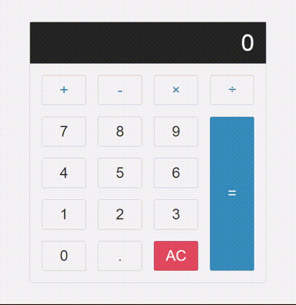

# HesapMakinesi

-Html ve Css ile sayfa tasarımı yapıldı

-Javascript ile butoların bulunduğu div elemetinin click olayı dinlendi

-Tıklanılan butonun value sine göre switch case ile oparetör belirlendi.

-İşlem sonucu input kısmına yazdırıldı

# JsHesapMakinesi
